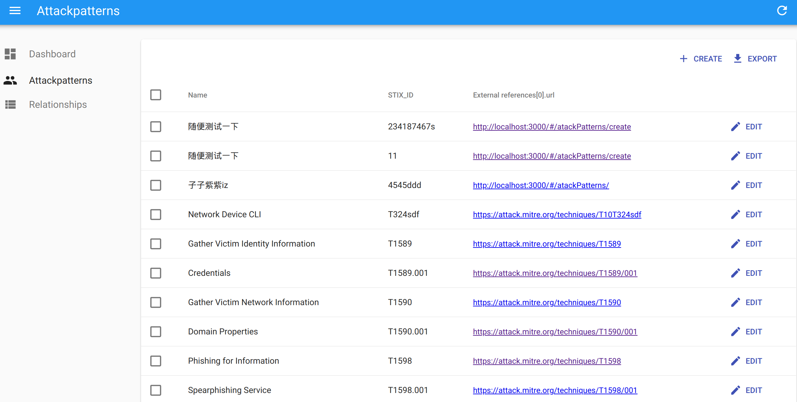
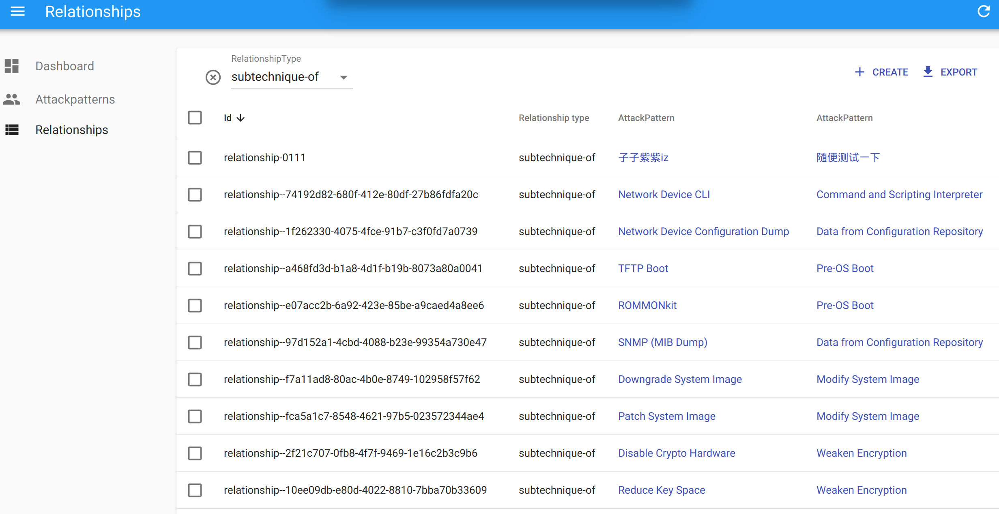
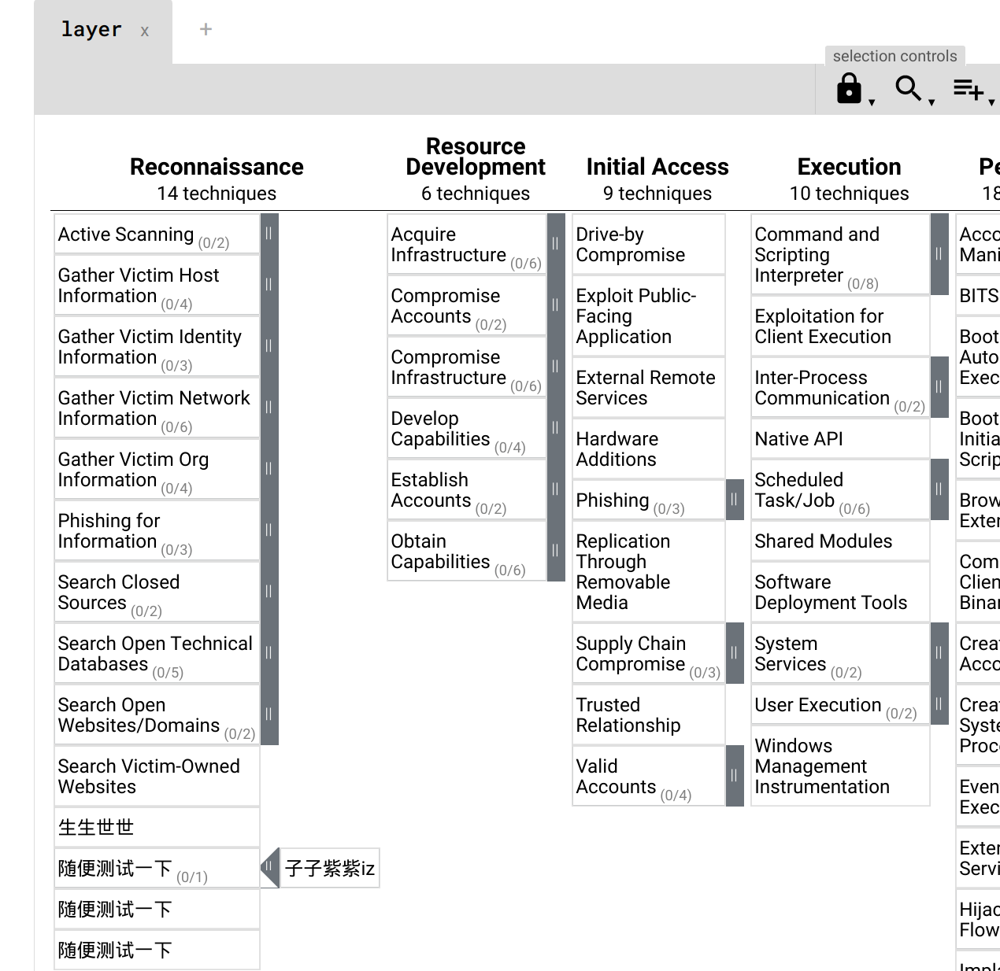

# Attack-Seaman

Golang + Mongodb + react-admin

## 编辑 Hosts

操作系统 | Hosts 文件位置
-|-
Linux|`/etc/hosts`
Windows|`C:\Windows\System32\drivers\etc\hosts`
Mac|`/private/etc/hosts`

添加一行
```bash
127.0.0.1 attack-seaman.com
```

## Docker

```sh
#通过 docker 启动项目 
docker-compose up -d

# 查看特定 container （如：api）日志
docker-compose logs api

# 访问本地 attack-seaman.com:3000 如数据、操作等均无误则说明启动成功
```

## Dev

```sh
# /src/config.yml 配置好 mongodb connection
# api /src
cd src
go run .

# app /frontend
# yarn 不行就试试 npm
cd ../frontend
yarn & yarn start
```

### Mitre ATT&CK 编辑






添加好 (Sub)Technique 以及 Relationship(如果需要) 之后：

```sh
# 导出修改后的 enterprise.json 
mongoexport --db 'yourDb' --collection 'yourCollestion' --jsonArray --pretty> new.json

# 完善格式，在头部添加如下内容：
{"type": "bundle","id": "bundle--ad5f3bce-004b-417e-899d-392f8591ab55","spec_version": "2.0","objects":

# 否则 Navigator 无法解析。可用 sed 完成：
sed -i '1s/^/{"type": "bundle","id": "bundle--ad5f3bce-004b-417e-899d-392f8591ab55","spec_version": "2.0","objects":/' new.json

# 在尾部添加 }
echo '}'>>new.json
```

Attack-Navigator 修改 domain 加载的路径为刚刚得到的`new.json`：




# Refs
- [Ten-Minutes-App](https://github.com/Kirk-Wang/Ten-Minutes-App)
* [mongo-go-dirver offical examples](https://github.com/mongodb/mongo-go-driver/blob/master/examples/documentation_examples/examples.go)
* [Go by Example](https://gobyexample.com/)
* [gotify/server](https://github.com/gotify/server)
* [gin-jwt](https://github.com/appleboy/gin-jwt)

# Q
* [Composite literal uses unkeyed fields](https://stackoverflow.com/questions/54548441/composite-literal-uses-unkeyed-fields)
* [Convert between int, int64 and string](https://yourbasic.org/golang/convert-int-to-string/)
* [go test -run does not work for a particular test](https://github.com/stretchr/testify/issues/460)